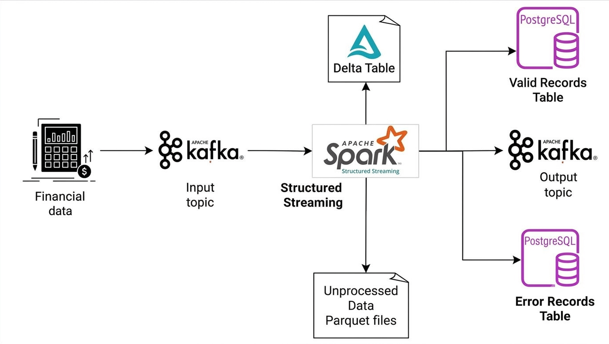

# Real-Time Cashback Pipeline - Kafka and Spark Structured Streaming

## Overview



A streaming pipeline that simulates purchase transactions, evaluates them for cashback eligibility in real time, and demonstrates a broad set of Kafka and Spark Structured Streaming features end to end: keyed partitioning, exactly-once-ish producer delivery, schema evolution, watermarking, deduplication, windowed aggregation, stream-stream joins, a Delta Lake upsert sink, and multiple concurrent streaming queries.

Kafka is running in docker container with KRaft. Both controller and broker is configured in the same node. (Controller is for managing the cluster and metadata)

Spark is running in another docker container. The data is recieved from a kafka topic and being processed by spark.

And the eligible customer with the cashback details is sent to another kafka topic to give the cashback and also to a postgres db table to keep the record and malformed incoming data i.e the error data will be stored in postgres db table for further processing without sending to the downstream.

Incase of any exceptional scenario such as unavailability of database, the unprocessed data will be saved as a parquet file in a directory for reprocessing. 

Postgres runs in a container and the tables'll be created while initializing the container with init.sql file in init_scripts directory.

And a real time analysis query computes merchant stats and stores it in delta table.

---
 
## Project structure

```
.
├── docker-compose.yml       # Kafka, Postgres, Spark services
├── Dockerfile                # Custom Spark image (pyspark + delta-spark pinned)
├── init.sql                  # Postgres table definitions, run on first container start
├── producer.py                # Generates and sends simulated transactions/refunds
├── streaming.py               # The Spark Structured Streaming pipeline
└── requirements.txt            # Python deps for producer.py (run outside Docker)
```
 
## What this project demonstrates
 
### Kafka
- **Keyed partitioning** — every message is keyed (`customer_id` on transactions, `refund_id`'s linked `customer_id` on refunds, `customer_id` again on the eligible-customers output), so a given customer's records always land in the same partition and stay in order.
- **Delivery guarantees** — the producer sets `acks=all` and `enable.idempotence=True`, so a network retry can't silently duplicate a message at the broker level.
- **Delivery callbacks** — every `produce()` call is wired to an `on_delivery` callback that logs the topic, partition, and offset once the broker confirms the write.
- **Multiple topics** — `cashback_topic` (transactions), `refunds_topic` (refunds), `eligible_customers_topic` (pipeline output), each with its own purpose.
- **Schema evolution** — the producer sends both a v1 shape (no `payment_method`) and a v2 shape (with it), and the consumer's schema (`payment_method` as nullable) handles both without branching logic.
### Spark Structured Streaming
- **Event-time watermarks** — `withWatermark("timestamp", "15 minutes")` on both the transaction and refund streams, bounding how much state Spark keeps for late data.
- **Deduplication** — `dropDuplicates(["transaction_id"])`, watermark-bounded, removing the producer's simulated retries.
- **Windowed aggregation** — 5-minute tumbling windows per merchant (`total_amount`, `txn_count`), enriched with refund data from a join (see below).
- **Stream-stream join** — transactions joined against refunds with a bounded time-range condition (`refund within 30 minutes of its transaction`), computed *before* aggregation (the well-supported order — aggregating two separately-aggregated streams and then joining them is not).
- **Multiple concurrent queries** — three independent `writeStream` queries running off shared upstream DataFrames, so parsing/watermarking/dedup work isn't repeated per query.
- **Output modes** — `append` for row-level sinks (nothing is revised after being written), `update` for the windowed aggregation (a window's total can still change before it closes).
- **Triggers** — explicit `processingTime` intervals instead of running flat-out, batching more rows per write.
- **Checkpointing** — every query has its own checkpoint directory under a mounted volume, so progress survives a container restart.
- **Delta Lake `MERGE`** — the windowed aggregation upserts into a Delta table keyed on `(window_start, merchant_id)`, so a window's row is updated in place across repeated "update"-mode emissions instead of accumulating duplicates.
- **Native Kafka sink with a key column** — the `eligible_customers_topic` output includes a `key` column, preserving the same per-customer partition ordering on the way out as on the way in.
---

## Data flow & schemas

### Data Simulation

The producer deliberately injects messy, real-world conditions on a predictable schedule, so every downstream feature has something to react to:
 
| Constant | Default | What happens |
|---|---|---|
| `MALFORMED_EVERY` | 30 | Every 30th transaction has a null `customer_id` or `timestamp` (alternating), exercising `error_table`. |
| `DUPLICATE_EVERY` | 20 | Every 20th transaction is sent twice with the same `transaction_id`, exercising `dropDuplicates`. |
| `LATE_EVERY` | 15 | Every 15th transaction has a timestamp `LATE_MINUTES` in the past, exercising the watermark. |
| `LATE_MINUTES` | 10 | How far in the past a late event's timestamp is. Kept safely inside the 15-minute watermark so late events are reliably accepted rather than sitting on the boundary. |
| `REFUND_EVERY` | 10 | Every 10th transaction triggers a refund for an earlier transaction, exercising the stream-stream join. |
| `V2_SCHEMA_EVERY` | 2 | Every even-numbered transaction includes `payment_method`, exercising schema evolution. |
| `INTERVAL_SEC` | 5 | Seconds between transactions. |
 
---
 
### Kafka topics
 
**`cashback_topic`** (producer → Spark), one JSON object per transaction:
```json
{
  "transaction_id": "trans_42",
  "customer_id": "cust_3",
  "timestamp": "2026-10-05 14:22:10",
  "product_id": "prod_5",
  "amount": 650,
  "merchant_id": "merch_1",
  "payment_method": "upi"
}
```
`payment_method` is only present on v2-shaped events (see Test Scenarios below) — its absence is intentional, not a bug.
 
**`refunds_topic`** (producer → Spark):
```json
{
  "refund_id": "refund_trans_42",
  "transaction_id": "trans_42",
  "customer_id": "cust_3",
  "refund_amount": 650,
  "timestamp": "2026-10-05 14:35:02"
}
```
 
**`eligible_customers_topic`** (Spark → downstream consumers), keyed by `customer_id`:
```json
{
  "customer_id": "cust_3",
  "amount": 650,
  "cashback": 97.5,
  "merchant_id": "merch_1",
  "timestamp": "2026-10-05 14:22:10",
  "payment_method": "upi"
}
```
 
### Postgres tables (`cashback_db`)
 
**`eligible_customers`** — one row per transaction that qualified for cashback (amount > 500, merchant is `merch_1` or `merch_3`). Cashback is written **instantly** — it does not wait on any refund check.
 
| Column | Type | Notes |
|---|---|---|
| `id` | `SERIAL PRIMARY KEY` | |
| `customer_id` | `VARCHAR(50) NOT NULL` | |
| `amount` | `INTEGER NOT NULL` | original transaction amount |
| `cashback` | `NUMERIC(10,2) NOT NULL` | 15% of `amount` |
| `merchant_id` | `VARCHAR(50) NOT NULL` | |
| `timestamp` | `TIMESTAMP NOT NULL` | event time from the payload |
| `payment_method` | `VARCHAR(20)` | nullable — absent on v1-schema events |
| `batch_id` | `BIGINT` | which micro-batch wrote this row |
 
**`error_table`** — malformed records (null `customer_id` or `timestamp`), kept for inspection rather than silently dropped.
 
| Column | Type | Notes |
|---|---|---|
| `id` | `SERIAL PRIMARY KEY` | |
| `value` | `TEXT` | the raw JSON string, unparsed |
| `event_timestamp` | `TIMESTAMP` | when Spark processed it |
| `batch_id` | `BIGINT` | |
 
### Delta table
 
**`merchant_window_stats`** (not Postgres — a Delta table at `/opt/spark/data/delta/merchant_window_stats`), one row per `(window_start, merchant_id)`, upserted via `MERGE` as each 5-minute window's totals change:
 
| Column | Meaning |
|---|---|
| `window_start`, `window_end` | the 5-minute tumbling window boundaries |
| `merchant_id` | |
| `total_amount` | sum of transaction amounts in this window |
| `txn_count` | number of transactions in this window |
| `refund_count` | how many of those transactions were refunded within 30 minutes |
| `total_refunded_amount` | sum of matched refund amounts |
| `net_amount` | `total_amount - total_refunded_amount` |
 
Unlike the two Postgres tables, this schema is **not declared anywhere** — Delta infers and evolves it automatically from whatever DataFrame is written.
 
---
## Key design decisions
 
- **Cashback pays out instantly, not gated on refunds.** Early iterations of this pipeline made cashback wait for the refund join to resolve before being written — correct in theory, but it meant a ~30-40 minute delay before any reward appeared, which defeats the point of an "instant cashback" product. The refund join was moved into the windowed merchant aggregation instead, where it reports refund-rate/net-revenue signals per merchant rather than gating individual payouts.
- **Join-then-aggregate, not aggregate-then-join.** The refund join happens at the row level, before `groupBy`. Joining two already-aggregated streaming DataFrames together is a much more fragile (often unsupported) pattern in Structured Streaming.
- **Delta Lake only for the windowed aggregation, Postgres for everything else.** The windowed aggregation is upsert-heavy (the same window gets re-emitted repeatedly as its total changes) — a natural fit for Delta's `MERGE`. The other two outputs are simple row-level logs, better served by a relational table you can query directly with `psql`.
- **`foreachBatch` + `persist()`/`unpersist()`** is used wherever a micro-batch feeds more than one downstream write (e.g., `eligible_customers` + the Kafka output topic), to avoid re-fetching the same batch from Kafka multiple times.
- **A parquet fallback** catches write failures (e.g., Postgres unreachable) so a sink outage doesn't silently drop data — it's written to `/opt/spark/data/parquet_output/` instead.
---

## Setup
To setup this project locally, follow these steps

1. **Clone This Repositories:**
  ```bash
  mkdir kafka_spark_streaming
  cd kafka_spark_streaming
  git clone https://github.com/Lashmanbala/kafka_spark_streaming
  ```

2. **Install Docker and Docker compose**
 
3. **Edit the docker compose file with your values of volumes and environment variables**

Replace `ec2-52-90-221-22.compute-1.amazonaws.com` with your own host's public DNS (or `localhost` if running everything on one machine with no remote access needed).

4. **Run docker compose file**
   ```bash
    docker compose up
   ```
   This starts three containers:
- `broker` — Kafka (KRaft mode, broker + controller combined)
- `postgres_db` — Postgres, running `init.sql` on first startup only
- `spark` — builds the custom image from `Dockerfile` and runs `streaming.py`
   
5. **Initialize kafka:**
   
   Get into the kafka container
   ```bash
    docker exec -it broker bash
    cd /opt/bitnami/kafka/bin
   ```
   Create kafka topics
   ```bash
    ./kafka-topics.sh --bootstrap-server localhost:9092 --replication-factor 1 --partitions 3 --create --topic cashback_topic  
    ./kafka-topics.sh --bootstrap-server localhost:9092 --replication-factor 1 --partitions 3 --create --topic eligible_customers_topic
    ```
   Subscribe to the output topic
    ```bash
    ./kafka-console-consumer.sh --bootstrap-server localhost:9092 --topic eligible_customers_topic --from-beginning
    ```
6. **Publish to kafka topic:**

   Create a virtual environment and install required kafka libraries in local
   ```bash
    pip install -r requirements.txt
   ```
   Run the producer script to publish data to kafka
   ```bash
   python3 producer.py
   ```
8. **Initalize Spark:**
   
   Get into Spark container
   ```bash
    docker run -it --user root -p 4040:4040 --network kafka_spark_streaming_network_1 -v /home/ubuntu/kafka_spark_streaming:/opt/spark/work-dir spark /bin/bash
   ```

   Submit spark structured streaming application
   ```bash
    spark-submit --master local[*] \
    --packages org.apache.spark:spark-sql-kafka-0-10_2.12:3.4.0,org.postgresql:postgresql:42.5.0 \
    /opt/spark/work-dir/streaming.py
   ```

10. **Check eligible_customers_topic in kafka and check eligible_customers table in postgres**

---
 
